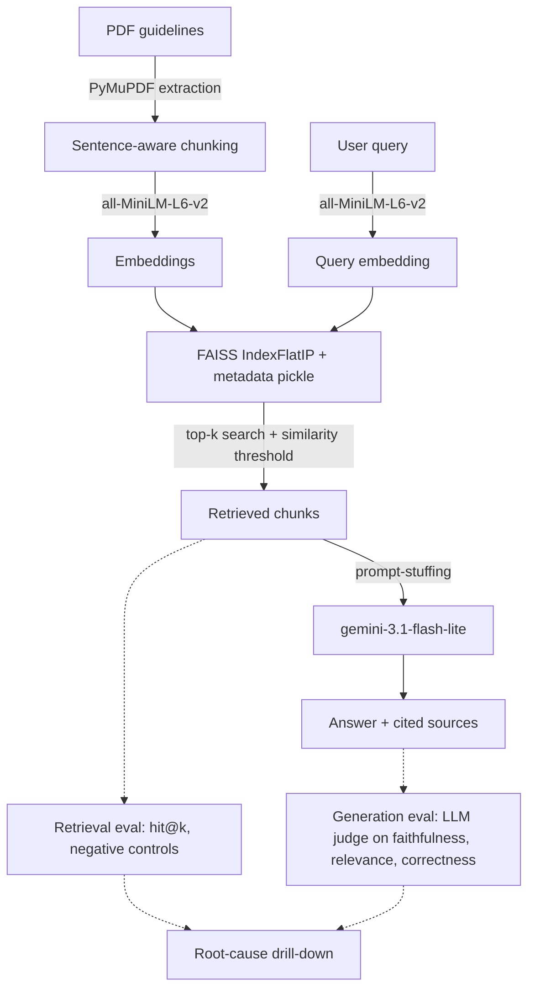

# Clinical-RAG-Agent

A retrieval-augmented generation pipeline over clinical treatment guideline PDFs, built with an evaluation layer that measures retrieval and generation separately instead of just checking whether the system produces an answer.

This is a technical RAG project, not a clinical tool. It is not medically validated, not reviewed by a health authority, and not intended for use in patient care. The subject matter (malaria treatment guidelines) is used because it's a real, publicly available document set with enough internal structure to make retrieval genuinely hard, which is what the project is actually testing.

## What it does

The system ingests PDF clinical guidelines (WHO malaria treatment guidelines, a national essential medicines list, a national standard treatment guideline, and similar documents), chunks and embeds them, and answers natural-language questions by retrieving relevant passages and generating an answer grounded only in what was retrieved. Every answer carries its source document, page number, and similarity score, so a claim can be checked against the guideline text it came from.

The distinguishing part of the project is the evaluation layer built on top of that pipeline: a hand-verified golden question set, a retrieval-only scorer, an LLM-judged generation scorer, and a root-cause drill-down that traces *why* specific questions fail, not just whether they fail. The findings from that layer directly changed the ingestion code (see Evaluation below).

## Document processing and embeddings

- Extraction: `malaria_embed_context.py` reads each PDF page by page with PyMuPDF (`fitz`).
- Chunking: text is split into sentences (regex-based, handling PDF line-wrap and paragraph breaks), then grouped into chunks targeting ~400 characters, capped at 600, with a one-sentence overlap carried into the next chunk for continuity. This replaced an earlier fixed 1000-character window with 650-character overlap, after evaluation showed that scheme diluted embeddings (see below).
- Embeddings: `sentence-transformers/all-MiniLM-L6-v2`, encoded and L2-normalized.
- Storage: a FAISS `IndexFlatIP` index plus a metadata pickle (`Source`, `Page Number`, `Content`) in `Malaria_db/`.

## Retrieval

`malaria_embed_query.py` embeds the incoming query with the same MiniLM model, searches the FAISS index for the top-k nearest chunks by inner product, and filters results below a similarity threshold (default 0.4). The Inspector view in the Streamlit app runs this with the threshold disabled, so you can see every candidate FAISS returned, including the ones the threshold would normally reject.

## Generation

`Malator.py` (FastAPI `/ask` endpoint) and `rag_core.py` (shared logic used by both the API and the Streamlit app) build a single prompt that stuffs the retrieved chunks into context with an explicit instruction: answer only from the content given, and say so if the answer isn't there. One call to `gemini-3.1-flash-lite` produces the answer. There is no self-check, re-ranking, or agentic loop yet, by design (see Roadmap).

## Evaluation and failure analysis

This is the part of the project that's actually being shown off, so the numbers below are the real output of the scripts in `eval/`, not illustrative figures.

**Retrieval** (`eval/retrieval_eval.py`) measures, for a 24-question hand-verified golden set (22 answerable questions plus 2 deliberate negative controls), whether the chunk from the expected source page shows up in the raw top-5 FAISS results, before any threshold filtering.

| Metric | Before rechunking | After rechunking |
|---|---|---|
| hit@1 | 31.8% | 40.9% |
| hit@3 | 45.5% | 63.6% |
| hit@5 | 59.1% | 72.7% |
| Negative controls correctly identified as absent | 0 of 2 | 0 of 2 |

The rechunking (sentence-aware, smaller windows, minimal overlap, described above) came directly from a root-cause investigation into the baseline misses, not a guess. Drilling past "missed top-5" into true rank across the whole index found that three unrelated questions (about antipyretics, GI-bleeding drug avoidance, and lab monitoring) all pointed to the same single chunk, because the original 1000-character chunk packed all three distinct facts into one embedding, diluting it into a mediocre match for all three and a strong match for none. Smaller, single-topic chunks fixed that specific mechanism, which is most of why hit@5 improved.

The negative controls did not improve, and that's a real, still-open finding, not an oversight: both negative-control questions (whose true source was deliberately never indexed) still retrieve confident, topically-adjacent matches from the wrong document. Cosine similarity over sentence embeddings can't distinguish "similar topic" from "actually answers this," and no amount of rechunking fixes that on its own; it would need a reranker or a relevance classifier on top of retrieval.

**Generation** (`eval/generation_eval.py`) runs the actual production path (threshold-filtered search, then the real prompt, then the real generation model) for every golden question, and scores each answer on faithfulness, relevance, and correctness using a separate model as judge (`gemini-3.5-flash-lite`, judging output from `gemini-3.1-flash-lite`) to avoid a model marking its own homework. Across the full 24-question set, generation never produced a confidently wrong answer: it declined honestly every time retrieval handed it inadequate or wrong-source context, including for the negative controls. That result was checked, not assumed. `eval/judge_sanity_check.py` feeds the judge five deliberately fabricated bad answers (a wrong drug, an invented drug combination, an evasive non-answer, a wrong number, and a partially-fabricated answer) to confirm the judge actually scores low when it should, rather than defaulting to 1.0. The judge correctly failed the fabricated answers, including landing at an intermediate 0.5 on the partial-fabrication case rather than snapping to 0 or 1.

The conclusion this analysis actually supports: retrieval, not generation, is the bottleneck in this pipeline. Generation was well-behaved under every failure condition tested. That reframes what a future self-check or agentic layer needs to catch: not fact-checking generation against itself, but noticing when retrieval likely missed and doing something about it before generation ever runs.

Full detail, including per-question scores and the drill-down methodology, is in [`EVALUATION_REPORT.md`](./EVALUATION_REPORT.md).

## Architecture



Two interfaces sit on top of the same `rag_core.py` logic: a FastAPI `/ask` endpoint (`Malator.py`) and a multipage Streamlit app (`streamlit_app.py`, `views/`, `ui/`) with Chat, Knowledge Base (shows which PDFs are actually indexed versus what's on disk, and can rebuild the index), Inspector (retrieval only, threshold disabled), and About pages.

## Limitations

- Not a validated or deployed clinical tool. No medical review, no regulatory clearance, no claim of diagnostic or treatment accuracy beyond what the evaluation numbers above actually show.
- The golden set is 24 questions over a corpus of 6 PDFs. That's enough to find and diagnose real failure mechanisms, but it's too small to treat the percentages above as tight statistical estimates.
- Negative-control handling is an unresolved, evidenced limitation: pure cosine-similarity retrieval over this embedding model cannot reliably tell "topically similar" apart from "actually relevant," and rechunking did not fix it.
- The judge model and the generation model are both "lite" tier from the same provider (chosen due to free-tier quota limits documented in `EVALUATION_REPORT.md`, after two other model choices hit quota or availability walls). A judge sanity check confirms it isn't rubber-stamping, but a full-size or cross-provider judge would still be a stronger independence guarantee.
- Retrieval quality currently appears to plateau with `all-MiniLM-L6-v2` at this corpus size even after the chunking fix; a larger or domain-tuned embedding model is untested here.
- There's a known ingestion failure mode: nothing in the pipeline checks that the FAISS index actually reflects what's currently in the PDF source folder. This was caught once by manual audit (documented in `EVALUATION_REPORT.md`) and is now surfaced in the Streamlit Knowledge Base page, but the underlying FastAPI path has no equivalent check.
- No agentic router or self-check loop yet. The evaluation layer was built first, deliberately, so that layer's future impact can be measured against this baseline instead of self-reported.

## Installation and usage

```bash
git clone https://github.com/pelumiibiks-cell/Clinical-RAG-Agent.git
cd Clinical-RAG-Agent
python -m venv venv && source venv/bin/activate
pip install -r requirements.txt
cp .env.mal.clone .env.mal   # then add your Gemini API key as THE_KEY
```

Source PDFs and the built index aren't shipped in the repo (see `.gitignore`); add your own guideline PDFs to `M_pdfs/`, then build the index:

```bash
python malaria_embed_context.py
```

Run the FastAPI service:

```bash
uvicorn Malator:app --reload
curl -X POST http://127.0.0.1:8000/ask \
  -H "Content-Type: application/json" \
  -d '{"query": "What is the first-line treatment for uncomplicated malaria?"}'
```

Or run the Streamlit app:

```bash
streamlit run streamlit_app.py
```

## Testing

There is no automated test suite (no `pytest`/`unittest` files in the repo). Correctness is currently checked through the evaluation scripts in `eval/`, which are the closest thing to tests here and are runnable directly:

```bash
python eval/retrieval_eval.py
python eval/generation_eval.py
python eval/judge_sanity_check.py
```

Each writes its results to a JSON file alongside itself (`retrieval_results_malaria.json`, `generation_results_malaria.json`, `judge_sanity_check_results.json`) for inspection. Adding an actual `pytest` suite around `rag_core.py` and the chunking functions in `malaria_embed_context.py` is a reasonable next step and isn't done yet.

## License

MIT, see [`LICENSE`](./LICENSE).
